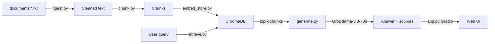

# Project 1 Planning: The Unofficial Guide

> Write this document before you write any pipeline code.
> Your spec and architecture diagram are what you'll use to direct AI tools (Claude, Copilot, etc.) to generate your implementation — the more specific they are, the more useful the generated code will be.
> Update the Retrieval Approach and Chunking Strategy sections if you change your approach during implementation.
> Update this file before starting any stretch features.

---

## Domain

<!-- What domain did you choose? Why is this knowledge valuable and hard to find through official channels? -->

The domain I chose is professor reviews for specific courses at Georgia Tech, with a focus on CS and ECE courses. This knowledge is valuable because course registration is a hectic time for students, and there is a large amount of information available across multiple platforms which can be overwhelming to search through manually. Students need to be able to compare instructors who teach the same course number, understand exam difficulty, and learn whether lectures are actually useful. This knowledge is hard to find through the registration website because OSCAR course descriptions and even Course Critique grade distributions do not describe teaching style, workload surprises, or qualitative student experiences. Sources such as Coursicle, the subreddit r/gatech, and Rate My Professor fill that gap. This system is designed to answer questions about class format, difficulty levels, and teaching styles for different professors.

---

## Documents

<!-- List your specific sources: URLs, subreddit names, forum threads, or file descriptions.
     Aim for at least 10 sources that together cover different subtopics or perspectives within your domain. -->

| # | Source | Description | URL or location |
|---|--------|-------------|-----------------|
| 1 | Coursicle | David Joyner professor reviews (CS 1301, grad courses) | https://www.coursicle.com/gatech/professors/David+Joyner/ |
| 2 | Coursicle | Frederic Faulkner professor reviews (CS 1332, CS 2050) | https://www.coursicle.com/gatech/professors/Frederic+Faulkner/ |
| 3 | Coursicle | Thad Starner professor reviews (CS 3600, CS 6601) | https://www.coursicle.com/gatech/professors/Thad+Starner/ |
| 4 | Coursicle | Charles Isbell professor reviews (CS 4641, ML courses) | https://www.coursicle.com/gatech/professors/Charles+Isbell/ |
| 5 | Coursicle | Monica Sweat professor reviews (CS 1332) | https://www.coursicle.com/gatech/professors/Monica+Sweat/ |
| 6 | Coursicle | Mary Hudachek-Buswell professor reviews (CS 1332) | https://www.coursicle.com/gatech/professors/Mary+Hudachek-Buswell/ |
| 7 | Coursicle | Konstantinos Dovrolis professor reviews (CS 3510) | https://www.coursicle.com/gatech/professors/Konstantinos+Dovrolis/ |
| 8 | Coursicle | Daniel Forsyth professor reviews (CS 2200, CS 2110) | https://www.coursicle.com/gatech/professors/Daniel+Forsyth/ |
| 9 | Coursicle | CS 1332 course page (multiple instructors compared) | https://www.coursicle.com/gatech/courses/CS/1332/ |
| 10 | Coursicle | CS 2200 course page (Summet, Forsyth sections) | https://www.coursicle.com/gatech/courses/CS/2200/ |
| 11 | Coursicle | CS 1301 course page (Joyner vs other instructors) | https://www.coursicle.com/gatech/courses/CS/1301/ |
| 12 | Coursicle | CS 4641 course page (ML instructor comparisons) | https://www.coursicle.com/gatech/courses/CS/4641/ |
| 13 | Coursicle | Kevin Johnson ECE reviews | https://www.coursicle.com/gatech/professors/Kevin+Johnson/ |
| 14 | Coursicle | Pulkit Gupta reviews (CS 2110, CS 6290) | https://www.coursicle.com/gatech/professors/Pulkit+Gupta/ |
| 15 | Student guide | How GT students use Course Critique and review sites | `documents/gt_professor_review_guide.txt` |

I plan to cover introductory courses (CS 1301), core CS requirements (CS 1332, CS 2200), difficult upper-division courses (CS 3510, CS 4641), and ECE crossover content. I will include both professor-level pages and course-level pages so the system can answer instructor-specific questions and compare multiple teachers for the same course. Coursicle will be the primary source. If automated fetching returns only a handful of reviews per page (Coursicle is JavaScript-rendered), I will manually copy additional reviews into the `.txt` files before building the index.

---

## Chunking Strategy

<!-- How will you split documents into chunks?
     State your chunk size (in tokens or characters), overlap size, and explain why those
     numbers fit the structure of your documents.
     A review-heavy corpus warrants different chunking than a long FAQ.

     Guiding questions — use these to think it through before deciding:
     - Are your documents short reviews (1–3 sentences) or long guides (many paragraphs)? How does that affect the right chunk size?
     - If a key fact spans two adjacent chunks, will either chunk be retrievable on its own? What does overlap help with?
     - How would you know if your chunks are too small? Too large? What would bad retrieval results look like in each case?

     Useful AI prompts:
     - "Explain how chunk size affects retrieval quality for short, opinion-based reviews."
     - "What are the tradeoffs between chunking by paragraph vs. fixed character count for [my document type]?"
     - "If I use 200-character chunks for review text, what kinds of queries might this fail for?" -->

**Chunk size:** 400 characters

**Overlap:** 80 characters

**Reasoning:**

My documents are short student reviews, typically one to three sentences each. A fixed 500+ character split would either merge unrelated reviews or cut through the middle of a single review. I will split first on `Review —` boundaries so each review stays a complete, retrievable thought. Each chunk will be prefixed with document header metadata (professor name, course, source URL) so it can stand alone during retrieval. Sentence-level splitting will be used only when a single review exceeds 400 characters. An 80-character overlap will help when a key fact spans two adjacent sentences so neither chunk loses necessary context. Chunks that are too small will become meaningless fragments e.g., "Professor's exams are heavily", while chunks that are too large could merge multiple unrelated reviews and dilute semantic matching during retrieval.

---

## Retrieval Approach

<!-- Which embedding model are you using (e.g., all-MiniLM-L6-v2 via sentence-transformers)?
     How many chunks will you retrieve per query (top-k)?
     If you were deploying this for real users and cost wasn't a constraint, what tradeoffs
     would you weigh in choosing a different embedding model — context length, multilingual
     support, accuracy on domain-specific text, latency?

     Guiding questions:
     - How many retrieved chunks is enough to give the LLM useful context? What happens if you retrieve too few? Too many?
     - Why does semantic search find relevant chunks even when the query doesn't share exact words with the document?

     Useful AI prompts:
     - "What are different strategies for structuring embeddings for short, opinion-based text?"
     - "What does top-k mean in a retrieval system, and what are the tradeoffs of setting it too high vs. too low?" -->

**Embedding model:** `all-MiniLM-L6-v2` via `sentence-transformers` 

**Top-k:** 5 chunks per query

**Production tradeoff reflection:**

I picked `all-MiniLM-L6-v2` because it runs locally, and thus requires no extra API key or cost for retrieval. If this were a real app with lots of users, I'd probably try a bigger embedding model like `e5-large` for better accuracy on review text, but for this project the local model is good enough.

I'm retrieving 5 chunks per query. Fewer than that and I might miss the one review that actually answers the question; more than that and the LLM gets a bunch of loosely related stuff. Semantic search should still work here, like a query about the "best CS 1332 professor" could match a review about how Faulkner explains data structures, even if those exact words aren't in the review.

---

## Evaluation Plan

<!-- List your 5 test questions with their expected correct answers.
     Questions should be specific enough that you can judge whether the system's response
     is right or wrong. "What are good dining halls?" is too vague.
     "What do students say about wait times at [dining hall name] during lunch?" is testable. -->

| # | Question | Expected answer |
|---|----------|-----------------|
| 1 | What do students say about David Joyner's CS 1301 course structure and grading? | Self-paced; unlimited homework retries; multiple test attempts; flexible/beginner-friendly |
| 2 | Which professor do students recommend for CS 1332 and why? | Frederic Faulkner; explains when you'd need each data structure/algorithm before teaching it |
| 3 | What complaints do students have about Thad Starner's AI courses? | Minimal lectures; heavy self-teaching; poor/unhelpful TAs; little guidance in CS 3600/6601 |
| 4 | How difficult is Konstantinos Dovrolis's CS 3510 according to reviews? | Hardest class at Tech; strict partial credit; small mistakes can cost 20%+ on a problem |
| 5 | What do students say about Jay Summet teaching CS 2200? | Rarely lectured; daily clicker questions; students read 400+ pages from dry textbook |

Each question is specific enough to grade as accurate, partially accurate, or inaccurate. Question 4 is the most likely failure case because the harshest review detail ("lose 20% per small mistake") may not rank in the top retrieved chunks if it is split across a chunk boundary or buried in a thin corpus.

---

## Anticipated Challenges

<!-- What could go wrong? Name at least two specific risks with reasoning.
     Consider: noisy or inconsistent documents, missing source attribution, off-topic
     retrieval, chunks that split key information across boundaries. -->

The first risk is chunk boundary splitting. When a long review exceeds 400 characters, the splitter may separate the review header from its most specific detail. Retrieval could then return a summary-style chunk instead of the sentence containing the exact fact.

The second risk is short or noisy reviews. One-line comments such as "Not bad" or "it's so over" carry weak semantic signal, making it harder for embeddings to match substantive queries.

A third risk is same-course instructor confusion. CS 1332 has multiple instructors (Sweat, Hudachek-Buswell, Faulkner) in the corpus, so a query must retrieve the correct professor's reviews rather than a negative review about a different instructor.

A fourth risk is review bias. Unhappy students post more frequently on anonymous review sites, so numeric ratings alone can mislead without reading multiple comments.

---

## Architecture

<!-- Draw a diagram of your pipeline showing the five stages:
     Document Ingestion → Chunking → Embedding + Vector Store → Retrieval → Generation
     Label each stage with the tool or library you're using.
     You can use ASCII art, a Mermaid diagram, or embed a sketch as an image.
     You'll use this diagram as context when prompting AI tools to implement each stage. -->

| Stage | Tool / file |
|-------|-------------|
| Document Ingestion | `ingest.py`: load .txt, strip boilerplate |
| Chunking | `chunk.py`: review-boundary splitting |
| Embedding | `all-MiniLM-L6-v2` via sentence-transformers |
| Vector Store | ChromaDB (`data/chroma/`) |
| Retrieval | `retrieve.py`: cosine similarity, top-k=5 |
| Generation | `generate.py`: Groq `llama-3.3-70b-versatile` |
| Interface | `app.py`: Gradio |

---

## AI Tool Plan

<!-- For each part of the pipeline below, describe:
     - Which AI tool you plan to use (Claude, Copilot, ChatGPT, etc.)
     - What you'll give it as input (which sections of this planning.md, which requirements)
     - What you expect it to produce
     - How you'll verify the output matches your spec

     "I'll use AI to help me code" is not a plan.
     "I'll give Claude my Chunking Strategy section and ask it to implement chunk_text()
     with my specified chunk size and overlap" is a plan. -->

**Milestone 3: Ingestion and chunking**

I will use Cursor/Claude with my Documents section, Chunking Strategy, architecture diagram, and Milestone 3 requirements as input. I expect it to produce `ingest.py` for loading and cleaning documents and `chunk.py` implementing 400-character chunks with 80-character overlap and review-boundary splitting. I will verify by printing five sample chunks and confirming each is readable, self-contained, free of HTML artifacts, and that total chunk count is reasonable for the corpus size.

**Milestone 4: Embedding and retrieval**

I will use Claude with my Retrieval Approach section, architecture diagram, and Milestone 4 requirements. I expect `embed_store.py` and `retrieve.py` storing chunks in ChromaDB with source filename and chunk index metadata. I will verify by running three evaluation questions and confirming top chunks are on-topic with distance scores below 0.5 for strong matches.

**Milestone 5: Generation and interface**

I will use Claude with grounding requirements, source attribution requirements, and the Gradio skeleton from project instructions. I expect `generate.py` with a context-only system prompt and `app.py` returning answer plus source list. I will verify that answers cite source files, out-of-scope questions receive a refusal response, and the model does not hallucinate facts not present in retrieved chunks.

For document collection specifically, I will use Claude to generate initial `documents/*.txt` files from Coursicle URLs, formatted with `Review —` headers. I will then review the output for completeness. 
